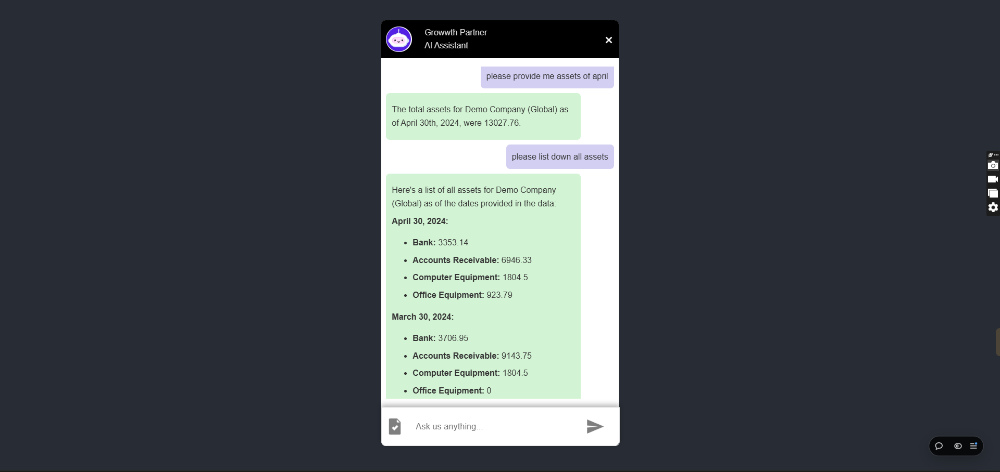
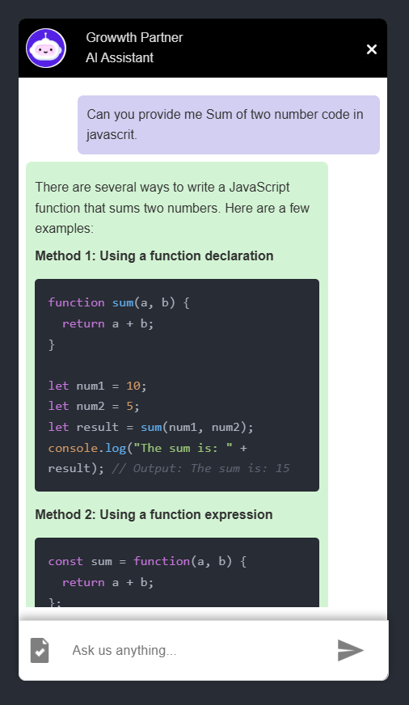

# ✨ AI Chat Assistance

#### AI Chat Assistance is a powerful tool designed to help users interact with an intelligent chatbot that can address their queries efficiently. Built with the cutting-edge Gemini AI model, this project leverages advanced natural language processing capabilities to provide insightful and context-aware responses.


  


## 🛠️ Features

- 🎨 **Chat Completion:** Engage in meaningful conversations with AI to address your queries in real-time.
- 🔤 **Query Prompt:** Provide specific prompts to guide the AI for precise and relevant answers.
- ⚡ **File Upload and Insights:** Upload files in supported formats (e.g., .xlsx, .xls). AI processes the uploaded file to extract valuable insights. Ask specific queries related to the content of the uploaded file.
- 🛠️ **Prompt History Management**: AI remembers the user's prompt history for context retention across sessions.

---

## 🖼️ Screenshots

| Customization Panel | Chatbot UI |
|---------------------|------------|
|  |  |

---
## 🚀 Quick Start

Follow these steps to get started with your customizable chatbot:

### 1️⃣ Clone the Repository
```bash
$ git clone https://github.com/Vicky8180/growth_part_assignmnt
$ cd custom-chatbot
```

### 2️⃣ Install Dependencies for frontend
```bash
$ npm install
```

### 3 Install Dependencies for backend
```bash
$ npm install
```
### 4 Environment variables configured in .env file for both frontend and backend
```bash
REACT_APP_BASE_URL_PORT="your backend server this is FOR FRONTEND .ENV" 
API_KEYY=<"your_gemini_ai_api_key this is FOR BACKEND .ENV">
```

### 5 Start the Development Server
```bash
$ npm start
```
The app will be available at `http://localhost:3000`.

### 6 Build for Production
```bash
$ npm run build
```
Your optimized app will be in the `build/` directory.

---

## 📚 Technologies Used

- **React:** A JavaScript library for building user interfaces.
- **Redux:** State management for predictable and scalable apps.
- **CSS Modules:** Scoped and reusable styling.
- **Node& Express:** Scoped and reusable styling.
- **Gemini AI Model** Gemini AI model for robust natural language processing.

---

## 🤝 Contributing

Contributions, issues, and feature requests are welcome! Feel free to:

1. Fork this repository.
2. Create a new branch: `git checkout -b feature-branch-name`.
3. Make your changes and commit them: `git commit -m 'Add some feature'`.
4. Push to the branch: `git push origin feature-branch-name`.
5. Submit a pull request.

---

## 📄 License

This project is licensed under the **MIT License**. See the [LICENSE](LICENSE) file for details.

---

## 💬 Contact

For support or inquiries, please reach out:

- Email: [vyadav99x1@gmail.com](vyadav99x1@gmail.com)
- GitHub: [https://github.com/Vicky8180](https://github.com/Vicky8180)

---

### Made with ❤️ by [Anoop Yadav].
